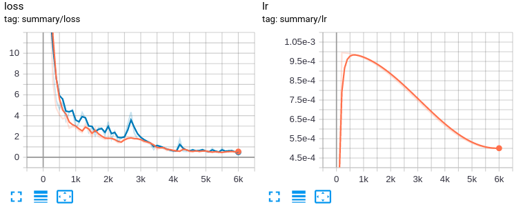

## Introduction
This is an easy implementation of siamese network based on Tensorflow. 


## Installation
```bash
$ pip install -r requestments.txt
````
## Train
```bash
$ python3 simese_net.py
``` 
## Generate pb file
```bash
$ python3 generate_pb.py 
```
## Inference
```bash
$ python3 inference_siamese.py 
```
## Train process 


## Reference
```bash
Learning a similarity metric discriminatively, with application to face verification
```


